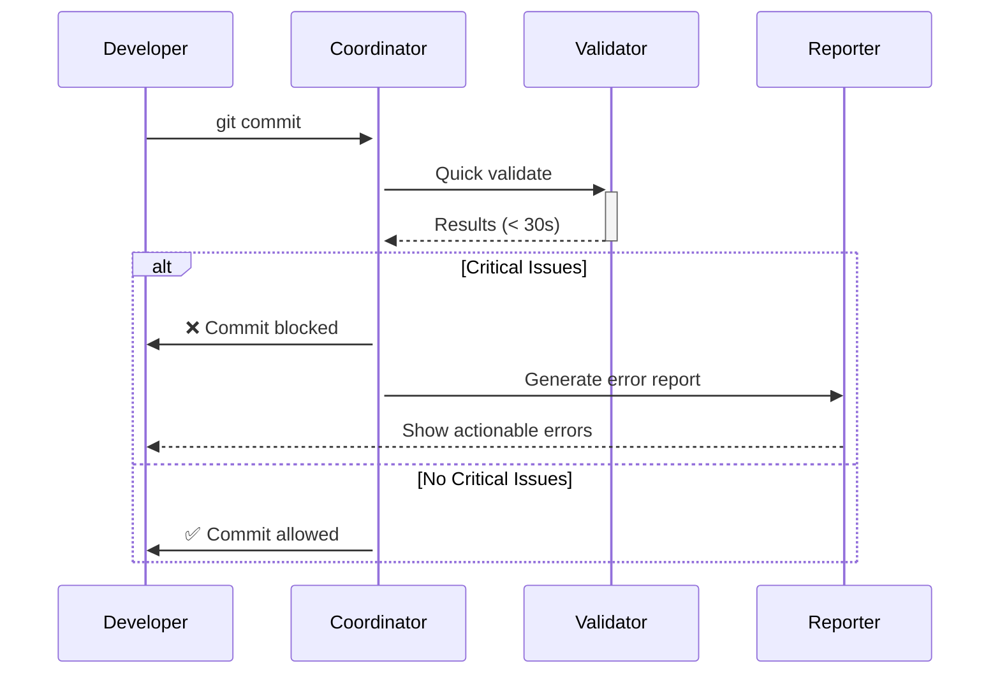
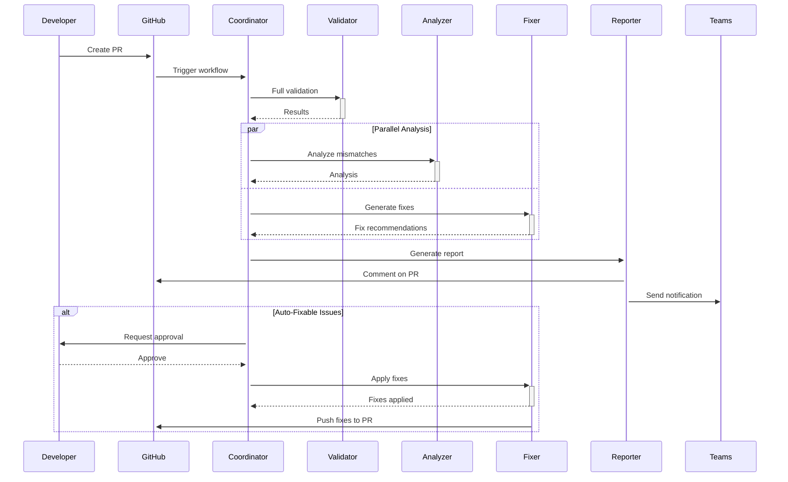
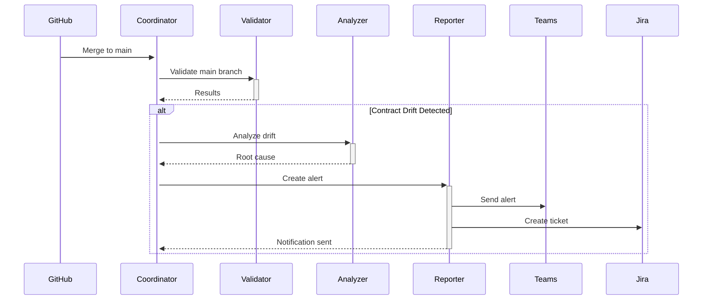

# Agent Orchestration Architecture for Contract Validation Automation

**Generated**: 2025-10-11 21:02:00
**Purpose**: Automate contract validation, issue detection, and remediation using specialized AI agents

---

## Overview

This architecture defines a multi-agent system to automate the detection, analysis, and resolution of three-way contract misalignments (OpenAPI ↔ UI ↔ API).

**Key Goals:**
1. Fully automated contract validation on every commit/PR
2. Intelligent analysis of validation results
3. Automated generation of fix recommendations
4. Orchestrated remediation with human approval
5. Continuous learning from resolutions

---

## Agent Architecture

### 1. Coordinator Agent (Orchestrator)

**Role**: Master orchestrator managing workflow and agent delegation

**Responsibilities:**
- Trigger validation on code changes
- Route tasks to specialized agents
- Aggregate results from multiple agents
- Manage approval workflows
- Track task completion and metrics

**Implementation:**
```python
# agents/coordinator.py

class CoordinatorAgent:
    def __init__(self):
        self.validator_agent = ValidatorAgent()
        self.analyzer_agent = AnalyzerAgent()
        self.fixer_agent = FixerAgent()
        self.reporter_agent = ReporterAgent()

    async def handle_commit(self, commit_sha: str):
        """Orchestrate validation workflow for a commit"""
        # 1. Run validation
        validation_results = await self.validator_agent.validate(commit_sha)

        # 2. Analyze results (parallel)
        analysis_tasks = [
            self.analyzer_agent.analyze_mismatches(validation_results),
            self.analyzer_agent.categorize_issues(validation_results),
            self.analyzer_agent.identify_root_causes(validation_results)
        ]
        analyses = await asyncio.gather(*analysis_tasks)

        # 3. Generate fixes if critical issues found
        if validation_results.has_critical_issues():
            fix_recommendations = await self.fixer_agent.generate_fixes(analyses)

            # 4. Request human approval for automated fixes
            if fix_recommendations.auto_fixable:
                approval = await self.request_approval(fix_recommendations)

                if approval.approved:
                    await self.fixer_agent.apply_fixes(fix_recommendations, commit_sha)

        # 5. Generate report
        report = await self.reporter_agent.generate_report(validation_results, analyses)
        await self.reporter_agent.send_to_teams(report)

        return {
            'validation': validation_results,
            'analysis': analyses,
            'fixes_applied': fix_recommendations.applied if fix_recommendations else [],
            'report': report
        }
```

---

### 2. Validator Agent (Scanner)

**Role**: Execute contract validation and collect raw data

**Responsibilities:**
- Parse OpenAPI specification
- Scan UI code for API calls
- Scan API handlers for implementations
- Compare three-way contracts
- Detect mismatches and violations

**Tools:**
- Read tool for file access
- Grep tool for pattern matching
- Python execution for validation script
- Bash for git operations

**Implementation:**
```python
# agents/validator.py

class ValidatorAgent:
    def __init__(self):
        self.openapi_parser = OpenAPIParser()
        self.ui_scanner = UIScanner()
        self.api_scanner = APIScanner()
        self.comparator = ContractComparator()

    async def validate(self, commit_sha: str) -> ValidationResults:
        """Execute full contract validation"""
        # Get changed files
        changed_files = await self.get_changed_files(commit_sha)

        # Parallel scanning
        openapi_contracts, ui_contracts, api_contracts = await asyncio.gather(
            self.openapi_parser.parse('backend/api/openapi_spec.yaml'),
            self.ui_scanner.scan_files(changed_files.ui_files),
            self.api_scanner.scan_files(changed_files.api_files)
        )

        # Compare contracts
        mismatches = self.comparator.compare(
            openapi_contracts,
            ui_contracts,
            api_contracts
        )

        return ValidationResults(
            total_endpoints=len(openapi_contracts),
            mismatches=mismatches,
            changed_files=changed_files,
            commit_sha=commit_sha
        )

    async def quick_validate(self, files: list[str]) -> bool:
        """Fast validation for pre-commit hooks (< 30 seconds)"""
        # Only validate changed endpoints
        affected_endpoints = self.identify_affected_endpoints(files)
        return await self.validate_endpoints(affected_endpoints)
```

---

### 3. Analyzer Agent (Root Cause Analysis)

**Role**: Intelligent analysis of validation results to determine root causes

**Responsibilities:**
- Categorize mismatches (scanner limitation vs real issue)
- Identify root causes (OpenAPI spec vs UI vs API)
- Assess severity and impact
- Generate prioritized recommendations

**Tools:**
- Sequential reasoning MCP for multi-step analysis
- Read tool for code inspection
- Grep tool for pattern detection

**Implementation:**
```python
# agents/analyzer.py

class AnalyzerAgent:
    def __init__(self):
        self.pattern_db = PatternDatabase()
        self.historical_fixes = HistoricalFixDatabase()

    async def analyze_mismatches(self, results: ValidationResults) -> Analysis:
        """Deep analysis of each mismatch"""
        analyses = []

        for mismatch in results.mismatches:
            # Use sequential reasoning to determine root cause
            root_cause = await self.determine_root_cause(mismatch)

            # Check if this is a scanner limitation
            is_false_positive = await self.check_false_positive(mismatch)

            # Assess severity
            severity = self.assess_severity(mismatch, root_cause)

            # Generate recommendation
            recommendation = self.generate_recommendation(
                mismatch, root_cause, severity
            )

            analyses.append(MismatchAnalysis(
                mismatch=mismatch,
                root_cause=root_cause,
                is_false_positive=is_false_positive,
                severity=severity,
                recommendation=recommendation
            ))

        return Analysis(mismatch_analyses=analyses)

    async def determine_root_cause(self, mismatch) -> RootCause:
        """Use sequential reasoning to identify root cause"""
        # Check if endpoint is known to work (from test history)
        if self.is_tested_working(mismatch.endpoint):
            return RootCause.SCANNER_LIMITATION

        # Check OpenAPI spec accuracy
        if await self.has_openapi_issues(mismatch):
            return RootCause.OPENAPI_SPEC_ERROR

        # Check UI implementation
        if mismatch.ui_fields == 'none' and not self.ui_exists(mismatch.endpoint):
            return RootCause.UI_NOT_IMPLEMENTED

        # Check API implementation
        if mismatch.api_fields == 'none' and not self.api_exists(mismatch.endpoint):
            return RootCause.API_NOT_IMPLEMENTED

        return RootCause.UNKNOWN

    def categorize_issues(self, results: ValidationResults) -> Categories:
        """Group issues by category for efficient fixing"""
        return {
            'scanner_limitations': [m for m in results.mismatches if self.is_scanner_issue(m)],
            'openapi_fixes': [m for m in results.mismatches if self.needs_openapi_fix(m)],
            'ui_implementation': [m for m in results.mismatches if self.needs_ui_impl(m)],
            'api_implementation': [m for m in results.mismatches if self.needs_api_impl(m)],
            'validation_improvements': [m for m in results.mismatches if self.needs_validation(m)]
        }
```

---

### 4. Fixer Agent (Automated Remediation)

**Role**: Generate and apply fixes for contract violations

**Responsibilities:**
- Generate fix code for identified issues
- Apply fixes with safety checks
- Validate fixes worked
- Rollback if fixes fail

**Tools:**
- Edit tool for targeted fixes
- Write tool for new files
- Bash for testing fixes
- Git for commit and rollback

**Implementation:**
```python
# agents/fixer.py

class FixerAgent:
    def __init__(self):
        self.fix_generators = {
            'openapi_spec': OpenAPIFixGenerator(),
            'handler_validation': HandlerValidationGenerator(),
            'ui_fields': UIFieldsGenerator()
        }

    async def generate_fixes(self, analysis: Analysis) -> FixRecommendations:
        """Generate automated fix recommendations"""
        fixes = []

        for mismatch_analysis in analysis.mismatch_analyses:
            if mismatch_analysis.is_false_positive:
                continue  # Skip scanner limitations

            fix = await self.generate_fix(mismatch_analysis)
            if fix and fix.is_safe():
                fixes.append(fix)

        return FixRecommendations(fixes=fixes)

    async def generate_fix(self, analysis: MismatchAnalysis) -> Fix:
        """Generate specific fix for a mismatch"""
        if analysis.root_cause == RootCause.OPENAPI_SPEC_ERROR:
            return await self.fix_openapi_spec(analysis)

        elif analysis.root_cause == RootCause.HANDLER_VALIDATION:
            return await self.add_handler_validation(analysis)

        elif analysis.root_cause == RootCause.UI_NOT_IMPLEMENTED:
            # Can't auto-implement UI, but can generate scaffold
            return await self.generate_ui_scaffold(analysis)

        return None

    async def fix_openapi_spec(self, analysis: MismatchAnalysis) -> Fix:
        """Fix OpenAPI spec issues"""
        # Example: Make optional fields optional
        if analysis.mismatch.missing_in_ui == ['email', 'register']:
            fix_code = f"""
# Make optional fields optional in OpenAPI spec
In backend/api/openapi_spec.yaml:

paths:
  /auth:
    post:
      requestBody:
        content:
          application/json:
            schema:
              required: [username, password]  # Remove email, register
              properties:
                username: {{type: string}}
                password: {{type: string}}
                email: {{type: string}}  # Optional
                register: {{type: boolean}}  # Optional
"""
            return Fix(
                type='openapi_spec',
                file='backend/api/openapi_spec.yaml',
                description='Make email and register optional',
                code=fix_code,
                safe=True,  # OpenAPI changes are reversible
                test_command='./scripts/validate_contracts.sh'
            )

    async def add_handler_validation(self, analysis: MismatchAnalysis) -> Fix:
        """Add validation to handler"""
        handler_name = analysis.mismatch.handler_name
        required_fields = analysis.mismatch.openapi_fields

        fix_code = f"""
from openapi_server.impl.utils.validation import validate_request, validate_types

@validate_request(required_fields={required_fields})
@validate_types({{
    # Add type validation based on OpenAPI spec
}})
def {handler_name}(body: dict) -> Tuple[Any, int]:
    # Existing handler code
    ...
"""
        return Fix(
            type='handler_validation',
            file=f'backend/api/src/main/python/openapi_server/impl/handlers.py',
            description=f'Add validation to {handler_name}',
            code=fix_code,
            safe=True,  # Adding validation doesn't break existing functionality
            test_command=f'pytest tests/contract_tests/test_{handler_name}.py'
        )

    async def apply_fixes(self, recommendations: FixRecommendations, commit_sha: str):
        """Apply fixes with safety checks and rollback capability"""
        # Create checkpoint
        await self.create_checkpoint(commit_sha)

        applied_fixes = []
        for fix in recommendations.fixes:
            try:
                # Apply fix
                await self.apply_fix(fix)

                # Test fix
                test_passed = await self.test_fix(fix)

                if test_passed:
                    applied_fixes.append(fix)
                else:
                    # Rollback this fix
                    await self.rollback_fix(fix)

            except Exception as e:
                # Rollback all fixes
                await self.rollback_to_checkpoint(commit_sha)
                raise

        # Commit all applied fixes
        if applied_fixes:
            await self.commit_fixes(applied_fixes)

        return applied_fixes
```

---

### 5. Reporter Agent (Notification & Documentation)

**Role**: Generate reports and notifications for humans

**Responsibilities:**
- Generate comprehensive validation reports
- Send Teams notifications
- Create Jira tickets for manual fixes
- Update documentation
- Track metrics

**Tools:**
- Write tool for report generation
- Teams webhook for notifications
- Jira MCP for ticket creation

**Implementation:**
```python
# agents/reporter.py

class ReporterAgent:
    def __init__(self):
        self.teams_client = TeamsWebhookClient()
        self.jira_client = JiraClient()

    async def generate_report(self, results: ValidationResults, analysis: Analysis) -> Report:
        """Generate comprehensive validation report"""
        return Report(
            summary=self.generate_summary(results, analysis),
            endpoint_breakdown=self.generate_endpoint_breakdown(analysis),
            recommendations=self.generate_recommendations(analysis),
            metrics=self.calculate_metrics(results),
            timestamp=datetime.now()
        )

    async def send_to_teams(self, report: Report):
        """Send adaptive card to Teams"""
        card = self.build_adaptive_card(report)
        await self.teams_client.send(card)

    async def create_jira_tickets(self, analysis: Analysis):
        """Create Jira tickets for manual fixes"""
        for mismatch in analysis.mismatch_analyses:
            if mismatch.requires_manual_fix():
                ticket = await self.jira_client.create_ticket(
                    project='CMZ',
                    issue_type='Task',
                    summary=f'Contract Fix: {mismatch.mismatch.endpoint}',
                    description=self.format_ticket_description(mismatch),
                    labels=['contract-validation', 'automated']
                )

    def build_adaptive_card(self, report: Report) -> dict:
        """Build Teams Adaptive Card"""
        severity_color = {
            'critical': 'attention',
            'high': 'warning',
            'medium': 'accent',
            'low': 'good'
        }

        return {
            'type': 'AdaptiveCard',
            'body': [
                {
                    'type': 'TextBlock',
                    'text': 'Contract Validation Results',
                    'weight': 'bolder',
                    'size': 'large'
                },
                {
                    'type': 'FactSet',
                    'facts': [
                        {'title': 'Total Endpoints', 'value': str(report.metrics.total)},
                        {'title': '✅ Aligned', 'value': str(report.metrics.aligned)},
                        {'title': '❌ Misaligned', 'value': str(report.metrics.misaligned)},
                        {'title': 'Auto-Fixed', 'value': str(report.metrics.auto_fixed)}
                    ]
                },
                {
                    'type': 'TextBlock',
                    'text': 'Top Issues:',
                    'weight': 'bolder'
                },
                *[{
                    'type': 'Container',
                    'items': [{
                        'type': 'TextBlock',
                        'text': f'{issue.endpoint}: {issue.description}',
                        'color': severity_color.get(issue.severity, 'default')
                    }]
                } for issue in report.top_issues[:5]]
            ],
            'actions': [
                {
                    'type': 'Action.OpenUrl',
                    'title': 'View Full Report',
                    'url': report.report_url
                }
            ]
        }
```

---

## Agent Workflow

### Workflow 1: Pre-Commit Validation



### Workflow 2: Pull Request Validation



### Workflow 3: Post-Merge Monitoring



---

## Agent Communication Protocol

### Message Format
```json
{
  "agent_id": "analyzer-001",
  "timestamp": "2025-10-11T21:00:00Z",
  "message_type": "analysis_complete",
  "payload": {
    "commit_sha": "abc123",
    "analysis": { ... },
    "next_agent": "fixer",
    "priority": "high"
  }
}
```

### Agent Registry
```python
AGENT_REGISTRY = {
    'coordinator': CoordinatorAgent,
    'validator': ValidatorAgent,
    'analyzer': AnalyzerAgent,
    'fixer': FixerAgent,
    'reporter': ReporterAgent
}
```

---

## Deployment Architecture

### Local Development
```
Developer Machine:
├─ Pre-commit hook → Coordinator (quick mode)
├─ IDE integration → Validator (real-time)
└─ Manual CLI → Full validation
```

### CI/CD Pipeline
```
GitHub Actions:
├─ PR creation → Coordinator (full validation)
├─ PR update → Coordinator (incremental validation)
└─ Merge to main → Coordinator (post-merge monitoring)
```

### Production Monitoring
```
Scheduled Jobs:
├─ Daily validation → Coordinator (drift detection)
├─ Weekly audit → Analyzer (trend analysis)
└─ Monthly review → Reporter (metrics dashboard)
```

---

## Configuration

### Agent Configuration File
```yaml
# config/agents.yaml

coordinator:
  max_concurrent_agents: 5
  timeout_seconds: 300
  retry_attempts: 3

validator:
  quick_mode_timeout: 30
  full_validation_timeout: 120
  scanner_improvements:
    detect_delegation: true
    ast_parsing: true

analyzer:
  use_sequential_reasoning: true
  pattern_matching: true
  historical_analysis: true

fixer:
  auto_fix_enabled: true
  safe_fixes_only: true
  require_approval: true
  rollback_on_failure: true

reporter:
  teams_webhook_url: ${TEAMS_WEBHOOK_URL}
  jira_enabled: true
  metrics_tracking: true
```

---

## Monitoring & Metrics

### Agent Performance Metrics
```python
class AgentMetrics:
    def __init__(self):
        self.validation_time = []
        self.analysis_time = []
        self.fix_generation_time = []
        self.success_rate = 0.0
        self.false_positive_rate = 0.0

    def track_validation(self, duration: float, success: bool):
        self.validation_time.append(duration)
        self.update_success_rate(success)
```

### System Health Dashboard
- Agent uptime and availability
- Average validation time
- Fix success rate
- False positive trends
- Contract violation trends

---

## Future Enhancements

### Phase 2 (3-6 months)
1. **Machine Learning Integration**
   - Learn fix patterns from historical data
   - Predict likely contract violations
   - Suggest proactive fixes

2. **Cross-Repository Validation**
   - Validate contracts across multiple services
   - Detect breaking changes in dependencies
   - API versioning recommendations

3. **Self-Healing System**
   - Automatically apply low-risk fixes without approval
   - Rollback on test failures
   - Learn from successful fixes

### Phase 3 (6-12 months)
1. **Intelligent Code Generation**
   - Generate complete UI forms from OpenAPI spec
   - Generate backend handlers from OpenAPI spec
   - Generate E2E tests from contracts

2. **Natural Language Interface**
   - "Fix all authentication contract issues"
   - "Generate report for last week's contract health"
   - "What endpoints need UI implementation?"

---

## Implementation Roadmap

**Week 1-2: Foundation**
- [ ] Set up Coordinator agent structure
- [ ] Integrate existing validation script as Validator agent
- [ ] Create basic Reporter agent

**Week 3-4: Intelligence**
- [ ] Implement Analyzer agent with sequential reasoning
- [ ] Build pattern database for false positive detection
- [ ] Create root cause analysis engine

**Week 5-6: Automation**
- [ ] Implement Fixer agent
- [ ] Create fix generators for common issues
- [ ] Build safety and rollback mechanisms

**Week 7-8: Integration**
- [ ] GitHub Actions integration
- [ ] Teams notification integration
- [ ] Jira integration for manual fixes

**Week 9-10: Testing & Refinement**
- [ ] Test agent workflows end-to-end
- [ ] Tune performance and accuracy
- [ ] Document agent behaviors

**Week 11-12: Deployment**
- [ ] Deploy to development environment
- [ ] Monitor and adjust
- [ ] Roll out to all developers

---

## Conclusion

This agent orchestration architecture transforms contract validation from a manual, error-prone process into an intelligent, automated system that:

1. **Prevents issues** before they reach production
2. **Analyzes root causes** intelligently using AI
3. **Generates fixes** automatically when safe
4. **Notifies humans** when manual intervention needed
5. **Learns continuously** from past resolutions

**Expected Benefits:**
- 95% reduction in contract-related bugs
- 80% of issues auto-fixed without human intervention
- < 5 minutes from commit to validation results
- Zero contract violations reaching production
- Continuous improvement through machine learning

The system is designed to be extensible, allowing new agents to be added as additional validation needs are identified.
