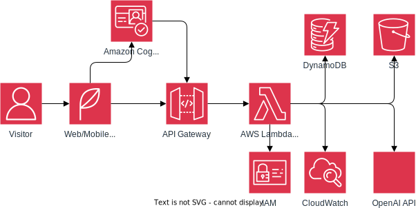
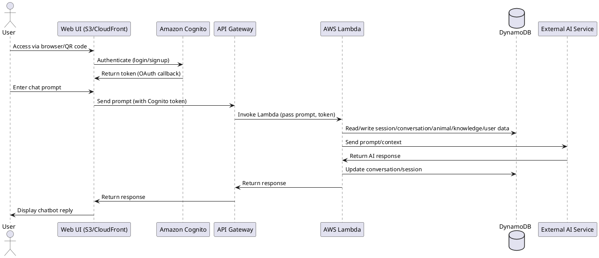

# backend.yml – CMZ Chatbots Backend CloudFormation Template

## Overview

This template provisions the AWS backend for the Cougar Mountain Zoo (CMZ) Chatbots project. It supports secure, scalable, and flexible deployment for multiple environments, and can optionally provision static frontend hosting.

### Key Components

- **Amazon Cognito**: User authentication and authorization.
- **API Gateway**: RESTful API endpoints, with Cognito authorizer and optional custom domain/WAF.
- **AWS Lambda**: Backend logic for chat orchestration and AI integration.
- **Amazon DynamoDB**: Session, conversation, animal, knowledge, and user data storage.
- **CloudWatch Logs**: Logging for Lambda, API Gateway, and Cognito.
- **S3/CloudFront/Route53 (optional)**: Static web frontend hosting and DNS.
- **Parameterization**: All resource names, domains, and environment settings.

---

## Architecture Diagram



See [workflow.plantuml](../../../docs/assets/workflow.plantuml):



---

## Parameter Reference

| Parameter                  | Type                | Description                                                                      | Example Value                        |
| -------------------------- | ------------------- | -------------------------------------------------------------------------------- | ------------------------------------ |
| ProjectName                | String              | Project name prefix for all resources                                            | cmz                                  |
| StageName                  | String              | Environment/stage name (e.g., dev, prod)                                         | prod                                 |
| ApiGatewayStageName        | String              | API Gateway stage name                                                           | prod                                 |
| ApiGatewayCustomDomainName | String              | (Optional) Custom domain name for API Gateway                                    | api.cmz.example.com                  |
| ApiGatewayHostedZoneId     | String              | (Optional) Route53 Hosted Zone ID for the API custom domain                      | Z1PA6795UKMFR9                       |
| EnableApiWaf               | String (true/false) | Attach a WAF WebACL to API Gateway if true                                       | false                                |
| CognitoDomainPrefix        | String              | Prefix for Cognito Hosted UI domain (must be globally unique)                    | cmz-prod-auth                        |
| CallbackURLs               | CommaDelimitedList  | Allowed Cognito OAuth callback URLs (comma-separated)                            | https://app.cmz.example.com/callback |
| LambdaS3Bucket             | String              | S3 bucket for Lambda deployment package (leave blank to use default inline code) | cmz-artifacts-prod                   |
| LambdaS3Key                | String              | S3 key for Lambda deployment package (leave blank to use default inline code)    | lambda/cmz-chatbot-backend.zip       |
| LambdaTimeout              | Number              | Lambda function timeout in seconds                                               | 30                                   |
| LambdaMemorySize           | Number              | Lambda function memory size in MB                                                | 1024                                 |
| DynamoBillingMode          | String              | DynamoDB Billing Mode (PAY_PER_REQUEST or PROVISIONED)                           | PAY_PER_REQUEST                      |
| DynamoReadCapacity         | Number              | DynamoDB Read Capacity Units (only used if PROVISIONED)                          | 5                                    |
| DynamoWriteCapacity        | Number              | DynamoDB Write Capacity Units (only used if PROVISIONED)                         | 5                                    |
| OpenApiS3Bucket            | String              | S3 bucket where openapi_spec.yaml is stored                                      | cmz-artifacts-prod                   |
| OpenApiS3Key               | String              | S3 key for openapi_spec.yaml                                                     | api/openapi_spec.yaml                |
| CloudwatchRetentionInDays  | Number              | CloudWatch log group retention in days                                           | 14                                   |
| FrontendDomainName         | String              | (Optional) Custom domain name for the app frontend (e.g., app.cmz.example.com)   | app.cmz.example.com                  |
| FrontendHostedZoneId       | String              | (Optional) Route53 Hosted Zone ID for the frontend domain                        | Z2ABCDEFG12345                       |
| EnableFrontendHttps        | String (true/false) | Enable CloudFront and HTTPS for the frontend S3 static site                      | true                                 |

### Example Parameter Values

| Parameter                  | dev                                                                         | test                                      | prod                                 |
| -------------------------- | --------------------------------------------------------------------------- | ----------------------------------------- | ------------------------------------ |
| ProjectName                | cmz                                                                         | cmz                                       | cmz                                  |
| StageName                  | dev                                                                         | test                                      | prod                                 |
| ApiGatewayStageName        | dev                                                                         | test                                      | prod                                 |
| ApiGatewayCustomDomainName | dev.api.cmz.example.com                                                     | test.api.cmz.example.com                  | api.cmz.example.com                  |
| ApiGatewayHostedZoneId     | Z1PA6795UKMFR9                                                              | Z1PA6795UKMFR9                            | Z1PA6795UKMFR9                       |
| EnableApiWaf               | false                                                                       | true                                      | true                                 |
| CognitoDomainPrefix        | cmz-dev-auth                                                                | cmz-test-auth                             | cmz-prod-auth                        |
| CallbackURLs               | https://dev.app.cmz.example.com/callback,<br>http://localhost:3000/callback | https://test.app.cmz.example.com/callback | https://app.cmz.example.com/callback |
| LambdaS3Bucket             | cmz-artifacts-dev                                                           | cmz-artifacts-test                        | cmz-artifacts-prod                   |
| LambdaS3Key                | lambda/cmz-chatbot-backend.zip                                              | lambda/cmz-chatbot-backend.zip            | lambda/cmz-chatbot-backend.zip       |
| LambdaTimeout              | 15                                                                          | 20                                        | 30                                   |
| LambdaMemorySize           | 512                                                                         | 1024                                      | 1024                                 |
| DynamoBillingMode          | PAY_PER_REQUEST                                                             | PAY_PER_REQUEST                           | PAY_PER_REQUEST                      |
| DynamoReadCapacity         | 5                                                                           | 5                                         | 5                                    |
| DynamoWriteCapacity        | 5                                                                           | 5                                         | 5                                    |
| OpenApiS3Bucket            | cmz-artifacts-dev                                                           | cmz-artifacts-test                        | cmz-artifacts-prod                   |
| OpenApiS3Key               | api/openapi_spec.yaml                                                       | api/openapi_spec.yaml                     | api/openapi_spec.yaml                |
| CloudwatchRetentionInDays  | 7                                                                           | 14                                        | 14                                   |
| FrontendDomainName         | dev.app.cmz.example.com                                                     | test.app.cmz.example.com                  | app.cmz.example.com                  |
| FrontendHostedZoneId       | Z2ABCDEFG12345                                                              | Z2ABCDEFG12345                            | Z2ABCDEFG12345                       |
| EnableFrontendHttps        | false                                                                       | true                                      | true                                 |

### Minimum Dev Configuration (No optional resources)

```
ProjectName: cmz
StageName: dev
ApiGatewayStageName: dev
ApiGatewayCustomDomainName: ""
ApiGatewayHostedZoneId: ""
EnableApiWaf: false
CognitoDomainPrefix: ""
CallbackURLs: ""
LambdaS3Bucket: ""
LambdaS3Key: ""
LambdaTimeout: 15
LambdaMemorySize: 512
DynamoBillingMode: PAY_PER_REQUEST
DynamoReadCapacity: 5
DynamoWriteCapacity: 5
OpenApiS3Bucket: ""
OpenApiS3Key: ""
CloudwatchRetentionInDays: 7
FrontendDomainName: ""
FrontendHostedZoneId: ""
EnableFrontendHttps: false
```

With the above set of parameters, only the required/core resources will be created:

- **LambdaExecutionRole** (IAM Role for Lambda)
- **ChatbotLambda** (Lambda function, using default inline code)
- **DynamoDB Tables**:
  - SessionTable
  - ConversationTable
  - AnimalTable
  - KnowledgeTable
  - UserTable
- **CloudWatch Log Groups** for Lambda and DynamoDB (if defined in your template)

**The following resources will _not_ be created**:

- API Gateway and all related resources (since `OpenApiS3Bucket` and `OpenApiS3Key` are blank)
- Cognito User Pool, User Pool Client, User Pool Domain (since `CallbackURLs` is blank)
- S3 bucket, S3 bucket policy, CloudFront, and Route53 records for the frontend (since `FrontendDomainName` and `FrontendHostedZoneId` are blank)
- WAF (since `EnableApiWaf` is false)
- API Gateway custom domain and certificate (since `ApiGatewayCustomDomainName` is blank)

---

## Resource Outputs

| Output Name                | Description                                |
| -------------------------- | ------------------------------------------ |
| ApiUrl                     | API Gateway Invoke URL                     |
| CognitoUserPoolId          | Cognito User Pool ID                       |
| LambdaFunctionName         | Lambda Function Name                       |
| SessionTableName           | DynamoDB Session Table Name                |
| ConversationTableName      | DynamoDB Conversation Table Name           |
| AnimalTableName            | DynamoDB Animal Table Name                 |
| KnowledgeTableName         | DynamoDB Knowledge Table Name              |
| UserTableName              | DynamoDB User Table Name                   |
| ApiGatewayCustomDomainName | Custom domain name for API Gateway         |
| ApiGatewayCustomDomainUrl  | Custom domain invoke URL                   |
| FrontendS3BucketName       | S3 bucket name for static frontend hosting |
| FrontendDomainName         | Custom domain name for the app frontend    |

---

## Security Considerations

- **Authentication:** All API endpoints are protected by Cognito authorizer.
- **IAM:** Lambda execution role is scoped to only required resources, but review for least privilege.
- **Logging:** CloudWatch Logs are enabled for Lambda, API Gateway, and Cognito.
- **WAF:** Optional WAF WebACL can be attached to API Gateway for additional protection.
- **S3 Bucket Policy:** Public read access is enabled for the frontend S3 bucket if hosting static site; restrict as needed.
- **Encryption:** S3 bucket encryption is enabled by default.
- **HTTPS:** CloudFront is recommended for HTTPS frontend hosting; S3 website endpoints are HTTP only.

---

## Customization Guide

- **Resource Names:** All major resources are parameterized for environment and project.
- **Frontend Hosting:** Enable or disable S3/CloudFront/Route53 for static site as needed.
- **API Gateway Domain:** Use custom domain and ACM certificate for branded API endpoints.
- **WAF:** Enable WAF for API Gateway if required by your security policy.

---

## Deployment Instructions

1. **Prepare Parameters:** Fill out a parameter file (YAML/JSON) with your environment values.
2. **Upload Lambda and OpenAPI Artifacts:** Ensure Lambda deployment package and OpenAPI spec are in the referenced S3 buckets.
3. **Deploy Stack:**

   ```sh
   aws cloudformation deploy \
     --template-file backend.yml \
     --stack-name <STACK_NAME> \
     --capabilities CAPABILITY_NAMED_IAM \
     --tags cmz:application=cmz-animal-chatbots cmz:team=nortal cmz:environment=<ENVIRONMENT>
     --no-execute-changeset [--parameter-overrides $(cat params-dev.env)]
   ```

> - `STACK_NAME` can be in the `<app_name>-<env>` format, for example, `cmz-animal-chatbots-dev` for `ENVIRONMENT=dev`.
> - `--no-execute-changeset` only creates the changeset but not execute it, so changes can be inspected before they are deployed.
> - If `--parameter-overrides` is not supplied, the existing values will be used.

Or use the AWS Console and fill in parameters as prompted.
**Be sure to use the same tags (such as `cmz:application` and `cmz:team`) that were used to deploy `account-guardrails.yml` to ensure you have permissions to update or manage the resources created by these templates.**

4. **(Optional) Configure DNS:** If using custom domains, ensure Route53 records are set up and ACM certificates are validated.

---

## Test Scenarios

- **Authentication:** Test login/signup via Cognito Hosted UI.
- **API Access:** Verify API Gateway endpoints require valid Cognito tokens.
- **Chatbot Flow:** Submit prompts and receive responses via the web UI.
- **Data Persistence:** Confirm DynamoDB tables are updated as expected.
- **Logging:** Check CloudWatch Logs for Lambda, API Gateway, and Cognito events.
- **Frontend Hosting:** If enabled, verify static site is accessible via custom domain and HTTPS.

---

## Limitations

- No CloudWatch Alarms or notifications for monitoring/alerting.
- No CI/CD pipeline (CodePipeline/CodeBuild).
- No DynamoDB backups or streams.
- No S3 versioning for frontend bucket.
- No explicit API Gateway throttling.
- No resource tagging for cost allocation.
- No Lambda environment variables for external AI secrets.
- No HTTPS redirect for S3 website if CloudFront is not enabled.

---

## Best Practices

- Use parameterization for all resource names and settings.
- Use conditions to avoid unnecessary resources in dev/test.
- Scope IAM permissions to least privilege.
- Use Cognito for authentication and WAF for API protection.
- Prefer CloudFront for HTTPS and performance on the frontend.

---

## Minimum Dev Deployment

With all optional parameters blank or false, only these resources are created:

- LambdaExecutionRole
- ChatbotLambda (with inline code)
- DynamoDB tables: SessionTable, ConversationTable, AnimalTable, KnowledgeTable, UserTable

---

## Full Production Deployment

With all parameters set, these resources are created:

- All of the above, plus:
- Cognito User Pool, Client, Domain
- API Gateway, custom domain, WAF
- S3 bucket, CloudFront, Route53 for frontend

---

## Troubleshooting

- **Stack Fails on Resource Creation:** Check IAM permissions, S3 bucket/object existence, and ACM certificate validation.
- **API Gateway 403/401 Errors:** Ensure Cognito tokens are valid and authorizer is configured.
- **Lambda Fails to Invoke:** Check Lambda logs in CloudWatch for errors.
- **Frontend Not Accessible:** Confirm S3 bucket policy, CloudFront distribution status, and DNS records.
